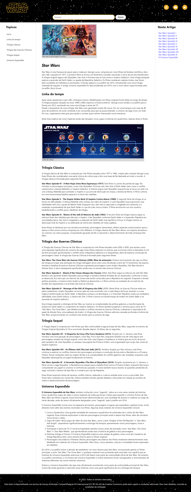

## 🏋️‍♂️ Desafio de Projeto HTML e CSS: Recriando o Wikipedia com Layout Moderno.

Desafio de projeto proposto no curso de Formação HTML Web Developer para criação de uma página semelhante ao Wikipedia.  
Os temas abordados são:   
- As propriedades básicas da linguagem de estilização.
- Estruturação e formatação de texto.
- As unidades de medidas
- Semântica e acessibilidade. 

Além de outros recursos.

## 💻 Tecnologias utilizadas nesse projeto:

  
  

## 💻 Preview:
- Veja como ficou o projeto acessando: [nesse link do Github Pages](https://ernandesneponuceno.github.io/Recriando-o-Wikipedia-com-Layout-Moderno/)
  

## 🤔 O que aprendi com esse projeto:
- Aprimorar minhas habilidades em HTML e CSS.
- Margem, preenchimento e fonte padrão.
- Propriedades de layout e visualização.
- Estilização de botões e ícones.
- Estilização de texto, posição dos elementos e boas práticas de design.

## 📌 Créditos:
- **Link do Github com instruções da atividade:**(https://github.com/digitalinnovationone/trilha-html-modulo-3)

